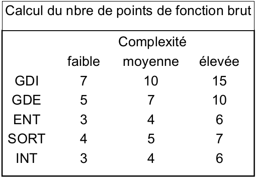
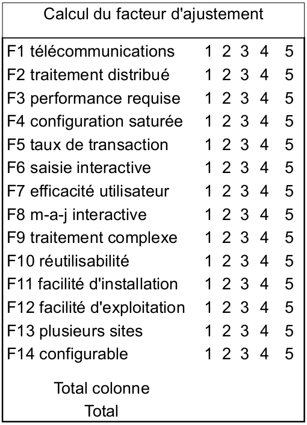
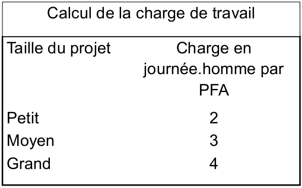

#Gestion de projet
[TOC]
Date: 10/10/2016

##Les grandes parties
* ITIL -> DSI
* SCRUM -> agile
* ISO 9001 -> norme de qualité

##OneNote class

Exercise : YYYY-MM-DD_E1-Acronyme
Trouver un mot pour chaque lettre de son nom.
**N**amaste
**O**urangoutang
**M**alade

Exercise 2 : Origine du QQOQCCP (3 lignes)
Comment on l'utilise, quel intérêt ça représente pour nous (5 lignes)

##Cycle de vie SI

###Acteurs et métiers

> **P**lan **D**o **C**heck **A**ct
(Roue dites de Deming dans ISO 9001)

**PLAN** Définition des besoins (software/hardware) qui ? quoi ? quand ? pourquoi ? combien ? comment ?
**DESIGN** Définitions des specs fonctionels
**BUILD** Phase de développement
**RUN** TMA corrective, évolution, adaptative, perfective - Infra **M**aintenance en **C**ondition **O**perationel

> Ex : Renault => Vend des voitures
> Processus (ensemble d'actions corrélés ou interactives qui transforme quelque chose) :
> 1. **Commerce**
> 2. **Production**
> 3. **Comptable**
> 4. Publicité / Marketing
> 5. R & D
> 6. RH
> 7. Logistique
> 8. Qualité
> 9. Service après vente
> 10. Juridique / Propriété intellectuele
> 11. SI
> 12. Financier (créer une plus-valus)
>
> Cycle de vie du métier commerce :
> * P :
>     * qui ? direction métier, DSI, Direction Financière
>     * pourquoi ? Acien système inéfficace
>     * quoi ? **C**ustomer **R**elation **M**anagement
>     * quand ? urgent
>     * combien ? +20% de ventes (direction commercial) 100 000€ (DSI +/-)
>     * comment ? OpenCRM
> Determination d'une **cible**, d'une **charge** et d'un **délais** -> un **projet**
> * D : Définition des specs fonctionel
> * B : Développement en respectant les spects, lancement
> * R :
>     * TMA
>     * MCO

Date : 11/10/2016

Exercise: 2016-10-11_E3-Chaos_Report à faire pour le 24/10/2016
[Standish group](https://www.projectsmart.co.uk/white-papers/chaos-report.pdf), société de conseil anglaise, produit une étude, le "chaos report". Référence de plus de 1000 projets informatique classés en 3 catégories :
* Délais, charge, cible réalisé
* Un ou deux paramètre pas réalisé, livré en retard
* Abandonné
Faire une synthèse critique, es ce que les projets sont représentatifs, es ce que les petits projets/start ups sont pris en compte dans ces études.

2016-10-24_E4_Plan
Finir le plan de la DSI, personne en interne pour faire des estimation, personne pour faire du dev, lancer un appel d'offre aupreès de plusieurs sociétés (Cap gemini, Cgi, ...), présenter ces offres.

####Distribution des rôles
Plan :
* MOA : DG, DF, DMétier
* MOE : DSI

Design :
* MOA : DSI
* MOE : SSII, Construteurs

##Methodes de gestion de projet
**Traditionel** ou **Agile**

---
Date : 24/10/2016
A faire pour la prochaine fois:
Corriger  le chaos report de (note sur 5):
* Deschamps Lea
* Dessombs Thomas
* Estrach Quentin

> **F**acilities **M**anagement (élec, clim, télécom ...)

Un processus projet doit àvoir une charge et un délai.
Ex Etchebest et le rougail saucisse, un beau matin fifou tombe sur une recette de rougaile saucisse.
En **Plan** Il réunit les chefs, la DG et ils brainstorment sur la *stratégie* (pourquoi ?, quand ?, qui?, quoi ?)
Une fois la stratégie établit et validé la phase **Design** consiste à rechercher des recettes, faire des essaies, du *prototypage* (comment ?, combien ?, quoi ?).
La phase **Build** sert à industrialiser le prototype, qui fait quoi quand en combien de temps ? On rajoute le plat sur la carte etc ...
**Run** : si quelqu'un commande un réalise le processus définit à la phase précédente, traiter les éventuels retours.

Faire les phase design et build par groupe de deux, se mettre à la place de HP qui à était choisit par la direction générale des impôts pour faire la platforme infra-réseaux (firewealls, switch, load balancers ...) dans les locaux de la cité administrative pour le 1er mars 2017 (date d'ouverture de la campagne de déclaration des impôts sur le revenue).
20 millions d'utilisateurs avec des pics d'accès de 100 000 utilisateurs en simultané. Faire un design et un POC.

Faire donc deux dessins, un pour le prototypage et un pour l'implémentation.

Date 07/11/2016

Exercice : Rechercher depuis quand un ingénieur/architecte à séparer la phase de réalistion d'une oeuvre (réalisé par le maitre d'oeuvre) en 2 partie conception et construction

méthode **SDMS** c'est un cycle en cascade, chaque phase suit la précédente et on ne revient pas en arrière il est décomposé en plusieurs parties, la phase desiign se décompose en :
* **D**efinition des **B**esoins du **S**ystème (MOA, client)
* **C**hoix de l'**A**rchitecture du **S**ystèm (MOE, fournisseur)
* **S**pécifications **E**xternes du **S**ystème (Specs fonctionels)
* **S**pécifications **I**nternes du **S**ystème (Conception technique)

La phase Build se décompose en :
* **PR**o**G**ramation
* **T**e**ST**
Et pour finir :
* **M**ise en **P**lace **P**ilote (mise en préprod)
* **GENE**raliser la solution
> utilisé principalement chez France Télécom et Orange

Autres méthodes de gestion de projets informatiques (brainstorming):

* ~~[KANBAN](https://stormpath.com/blog/so-long-scrum-hello-kanban)~~ phase run
* ~~Adaptive Project Framework~~, le scope s'adapte mais le délais et budget reste fixes
* **Dynamic Systems Development Model (DSDM)**, méthode agile qui s'appuie sur l'implication de l'utilisateur
* **Extreme Programming (XP)**, comme son nom l'indique pas de perte de temps avec les specs ou l'archi mais concentré sur la programmation
* ~~6 sigma~~
* ~~dogfooding~~
* ~~sprint~~ une itération de SCRUM
* ~~planning poker~~ méthode d'estimation utilisé en SCRUM ou XP
* ~~moscow~~ assitance maîtrise d'ouvrage phase PLAN
* **unified process**
* **SCRUM**
* ~~TDD Test driven development~~ implémenté dans les méthodes agiles
* ~~Fluffer~~
* ~~CoBIT~~ mesure la capacité d'une organisation à amélioré ces processus (qualité)
* ~~dual-programming~~ outil utilisé en XP
* **hermes**
* ~~rolling release~~
* ~~design sprint~~ planification de SCRUM
* ~~burndown chart~~
* ~~Yagni~~
* ~~MDE~~
* ~~KISS~~, Keep it simple stupid
* **cycle en V**
* ~~cowboy coding~~, les devs ont une autonomie sur le projet
* ~~RACHE~~
* ~~ITIL~~
* ~~worse is better~~
* **prince 2**
* **BMP/PMI**
* ~~book sprint~~, outil de brainstorming utilisé dans les méthodes agiles
* **RAD**
* ~~Agile~~ ensemble de méthodes
* ~~pyramide de mayol smith~~ Développement système en phase run
* **Crystal clear**
* **ARRACHE, à l'arrache**
* ~~Code and fix~~
* ~~2-TUP~~, MOA, phase plan
* **Axial**
* **RUP**
* ~~RLP~~, choix du langage de plus bas niveau
* ~~Agile~~ ensemble de méthodes

On retient 13 méthodes de gestion de projet :
Prince 2, BMP/PMI, DSDM, XP, Unified process, SCRUM, Hermes, cycle en V, RAD, Crystal Clear, ARRACHE, Axial, RUP

Exercie expliquer au maitre d'ouvrage pourquoi notre méthode de gestion de projet (hermes), est la meilleure pour la mise en place d'un outil informatique pour la gestion de la logistique, approvisionemment automatique ...
Nous sommes une équipe de 6 personne et la livraison doit être pour fin décembre.

##Hermes

> Sources :
> * https://en.wikipedia.org/wiki/HERMES_method
> * http://www.hermes.admin.ch/

###Introduction
Méthode de gestion de projet pour l'IT, les services, produits et organisations.

Développé par l'administration fédéral de la Suisse en 1975 la version actuelle HERMES 5 à vu le jour en 2012 c'est un standard ouvert disponible à tous le monde.

###Objectifs et concept

Réduits aux éléments essentiels, méthodes simple destinées aux chefs de projets.

Implique tous le monde, le client, le chef de projet, les spécialiste de l'exécution projet.

####Scénarios

HERMES contient plusieurs scénarios standards qui peuvent être adaptés avec des **modules** pour convenir au projet

Il se décompose en 4 phases :

* L'initialisation
* Le concept
* La réalisation
* Le déploiement

Plusieurs roles interviennent tout au long du projet :

* le client
* le chef de projet
* le spécialiste technique

Le projet est découpé en tâches, chaque tâche est assigné à un rôle et doit aboutir à un résultat.

RACHE
Avantages : Pas limité
Inconvénients : c'est n'importe quoi, cahier des charges résumé en mots

MERISE
Avantages : Français, old skool, bon sur un domaine
Inconvénients : Limité à un seul domaine.

> ISO 215000:2012 -> norme gestion de projet dérivé du PM-BOK
> ISO 9001 Norme du qualité de gestion de projet (satisfaction client et amélioration continu)

Date 14/11/2016

##Méthodes d'estimation de charges
* Abaque
* Planning Poker
* Cocomo
* Points de fonction
* Proportionnelle
* Delphi
* Expérience

> équipe agile 1cp pour 5-9 devs

Environ 10% de la charge dédié à la gestion du projet(conception, dev, test => 90)%

###Estimation du temps de développement (Abaque)
Points de fonction -> chiffres issues de statistiques de développment. ex : pour faire du dév il faut 40% du temps pour la conception, 20% pour le dev et 40% de test.
Prendre en compte une provision pour risque. entre 5 et 10% du temps du projet.

En mode run il faut assurer la garantie du projet, donc prévoir de la marge dans l'estimation du projet pour le temps passé, pas de temps de garantie obligatoire pour un soft mais prévu dans le contrat (3, 6 ou 12 mois en moyenne). 3 à 8 % du temps de projet.

Si le MOA exgige un CP certifié ISO 9001 la gestion de la qualité prend 5% du temps de projet.

Le temps d'un projet s'estime à partir de la charge de développement nécéssaire au projet.

###Points de fonctions
Découpage d'une application en processus et sous procéssus auquels ont donne un poids ce qui donne ensuite le coût en points de fonction de l'application.
On doit avoir le moins de PF possible pour un ensmble cohérant pour l'utilisateur.
+ degré d'ajustement entre 0.65% à 1.35%
PFB -> somme de tous les PF
PFA -> PFB * degré ajustement

####Calcul du nombre de points de fonction brut

La méthode distingue 5 types de composants fonctionnels :
* GDI Groupes de données internes
* GDE Groupes de données externes
* ENT Entrées de traitement
* SORT Sorties de traitement
* INT Interrogations

A chaque type de composant est attribué un certain nombre de points, en fonction du niveau de complexité (tableau du haut).
Le total est appelé PFB pour points de fonction brut

####Calcul du facteur d'ajustement.

14 paramètres sont pris en compte pour le calcul du facteur d'ajustement. Chaque facteur est affecté d'un degré d'influence Di dont la valeur varie de 1 à 5
FA = 0,65 + (0,01 x SOMME (Dii, i = 1 à 14)

####Du nombre de points à la charge

La dernière difficulté de la méthode consiste à traduire le nombre de points en charge de travail. Il semble ne pas y avoir de consensus sur la valeur du ratio charge de travail / taille en PFA. Ce ratio dépend de l'efficacité de l'équipe mais surtout de la taille de l'application. Le tableau ci-contre donne des valeurs couramment admises.